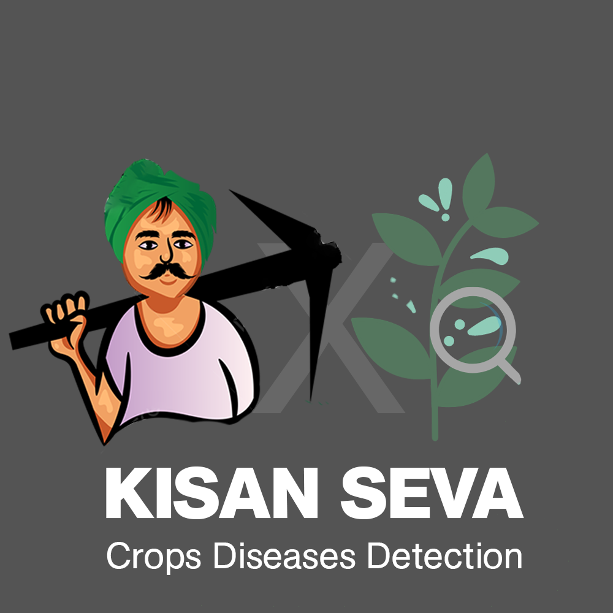

  

# Agent-Crop
This is the repository for the project Agent Crop. Agent Crop is used to identify the diseases in the crops and also suggests possible cure for them.  
The Pre-Trained Model can be found at: https://drive.google.com/file/d/1RptBAVHhoGcHydWHkRFpflj3WG8BMDJo/view?usp=sharing  

Here is the list of crops and the diseases we can support at this moment:

- Apple
  - Apple Scab
  - Black Rot
  - Cedar Rust
  - Healthy
- Blueberry
  - Healthy
- Cherry
  - Powdery Mildew
  - Healthy
- Corn(Maize)
  - Grey Leaf Spot
  - Common Rust of Maize
  - Northern Leaf Blight
  - Healthy
- Grape
  - Black Rot
  - Black Measles(Esca)
  - Leaf Blight(Isariopsis Leaf Spot)
  - healthy
- Orange
  - Huanglongbing(Citrus Greening)
- Peach
  - Bacterial spot
  - healthy
- Bell Pepper
  - Bacterial Spot
  - Healthy
- Potato
  - Early Blight
  - Late Blight
  - Healthy
- Raspberry
  - Healthy
- Rice
  - Brown Spot
  - Hispa
  - Leaf Blast
  - Healthy
- Soybean
  - Healthy
  - Squash
  - Powdery Mildew
- Strawberry
  - Leaf Scorch
  - Healthy
- Tomato
  - Bacterial Spot
  - Early Blight
  - Late Blight
  - Leaf Mold
  - Septoria Leaf Spot
  - Spider Mites (Two-spotted Spider Mite)
  - Target Spot
  - Yellow Leaf Curl Virus
  - Mosaic Virus
  - Healthy
